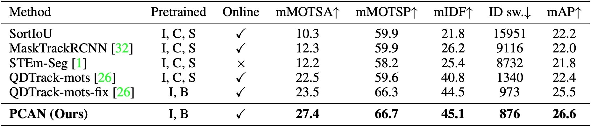

This is the official code repo for NeurIPS 2021 Spotlight "Prototypical Cross-Attention Networks for Multiple Object Tracking and Segmentation". Please find more info at https://www.vis.xyz/pub/pcan/. Code will be available soon.

# PCAN for Multiple Object Tracking and Segmentation

This is the offical implementation of paper [PCAN](https://arxiv.org/abs/2106.11958) for MOTS. 

We also present a [trailer](https://www.youtube.com/watch?v=Vt-kYDPfh10) that consists of method illustrations and tracking & segmentation visualizations. Our project website contains more information: [vis.xyz/pub/pcan](https://www.vis.xyz/pub/pcan/).

> [**Prototypical Cross-Attention Networks (PCAN) for Multiple Object Tracking and Segmentation**](https://arxiv.org/abs/2106.11958)  
> **NeurIPS 2021, Spotlight**  
> Lei Ke, Xia Li, Martin Danelljan, Yu-Wing Tai, Chi-Keung Tang, Fisher Yu


<div align="center">

</div>


## Abstract

Multiple object tracking and segmentation requires detecting, tracking, and segmenting objects belonging to a set of given classes. Most approaches only exploit the temporal dimension to address the association problem, while relying on single frame predictions for the segmentation mask itself. We propose Prototypical Cross-Attention Network (PCAN), capable of leveraging rich spatio-temporal information for online multiple object tracking and segmentation. PCAN first distills a space-time memory into a set of prototypes and then employs cross-attention to retrieve rich information from the past frames. To segment each object, PCAN adopts a prototypical appearance module to learn a set of contrastive foreground and background prototypes, which are then propagated over time. Extensive experiments demonstrate that PCAN outperforms current video instance tracking and segmentation competition winners on both Youtube-VIS and BDD100K datasets, and shows efficacy to both one-stage and two-stage segmentation frameworks. 

## Prototypical Cross-Attention Networks (PCAN)


## Main results
Without bells and whistles, our PCAN outperforms the states of the art on BDD100K and Youtube-VIS benchmarks with ResNet-50 as the base model.


## Installation
Please refer to [INSTALL.md](docs/INSTALL.md) for installation instructions.

## Usages
Please refer to [GET_STARTED.md](docs/GET_STARTED.md) for dataset preparation and running instructions.


## Citation
If you find PCAN useful in your research or refer to the provided baseline results, please star :star: this repository and consider citing :pencil::
```
@inproceedings{pcan,
    author    = {Ke, Lei and Li, Xia and Danelljan, Martin and Tai, Yu-Wing and Tang, Chi-Keung and Yu, Fisher},
    booktitle = {Advances in Neural Information Processing Systems},
    title     = {Prototypical Cross-Attention Networks for Multiple Object Tracking and Segmentation},
    year      = {2021}
}
